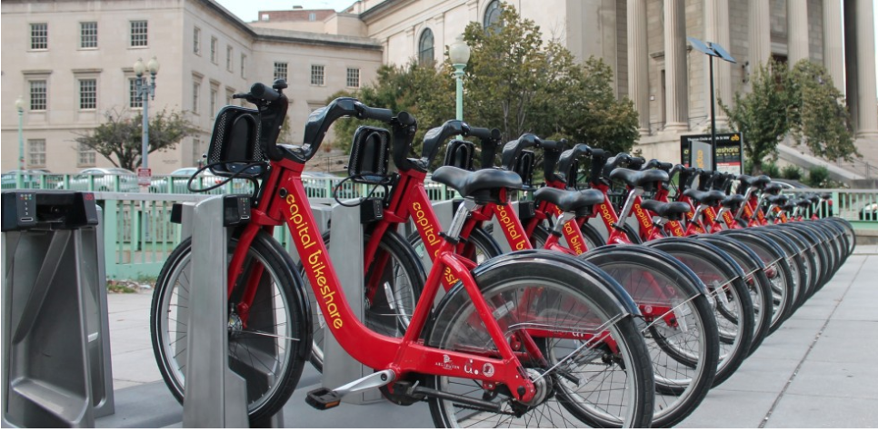

```{r setup, include=FALSE}
# clear-up the environment
rm(list = ls())

# chunk options
knitr::opts_chunk$set(
  message = FALSE,
  warning = FALSE,
  fig.align = "center",
  out.width = "600px", 
  comment = "#>"
)
```

```{r, out.width = "100%", echo = FALSE, fig.align = "center"}

```

<br>

# **INTRODUCTION**

Bike-sharing systems are a new generation of traditional bike rentals
where the whole process from membership, rental and return back has
become automatic. Through these systems, the user is able to easily rent
a bike from a particular position and return back to another position.
Today, there exists great interest in these systems due to their
important role in traffic, environmental, and health issues.

Apart from interesting real-world applications of bike-sharing systems,
the characteristics of data being generated by these systems make them
attractive for the research. Having features such as duration of travel,
departure, and arrival position, total bike number rented turns the
bike-sharing system into a virtual sensor network that can be used for
sensing mobility in the city. Hence, it is expected that the most
important events in the city could be detected via monitoring these
data.

Capital Bikeshare has more than 4300 bikes available at 500 stations
across 7 jurisdictions. With that number, Capital Bikeshare provides
residents and visitors with a convenient, fun, and affordable
transportation option for getting from point A to point B. People use
Capital Bikeshare to commute to work or school, run errands, get to
appointments or social engagements and more. <br><br>

# **DATA UNDERSTANDING**

We aggregated the data on daily basis and set limitation on only one station
Capital Bikeshare system and focusing on only the number of bikes rented.

```{r}
dataset <- read.csv("data_input/day.csv")
head(dataset)
tail(dataset)
```
<br>

## **COLUMNS EXPLANATION**

**instant**: recorded index <br>
**dteday**: date of transaction <br>
**season**: number representing season (1:Spring, 2:Summer, 3:Fall, 4:Winter) <br>
**yr**: number representing year (0:2011, 1:2012) <br>
**mnth**: number representing	Month (1:January to 12:December) <br>
**hr**:	number representing Hour (0 to 23) <br>
**holiday**: number representing (0:Not Holiday ; 1:Holiday) <br>
**weekday**: number representing	Day of the week (0:Sunday, 1:Monday, 2:Tuesday, 3:Wednesday, 4:Thursday, 5:Friday, 6:Saturday) <br>
**workingday**:	Whether Working day or Weekend (0:Weekend/Holiday, 1:Working Day) <br>
**weathersit**:	Weather Condition (1:Clear, Few clouds, Partly cloudy, Partly cloudy, 2:Mist + Cloudy, Mist + Broken clouds, Mist + Few clouds, Mist, 3:Light Snow, Light Rain + Thunderstorm + Scattered clouds, Light Rain + Scattered clouds, 4:Heavy Rain + Ice Pallets + Thunderstorm + Mist, Snow + Fog) <br>
**temp**:	Normalized temperature in Celsius. The values are divided to 41 (max) <br>
**atemp**:	Normalized feeling temperature in Celsius. The values are divided to 50 (max) <br>
**hum**:	Normalized humidity. The values are divided to 100 (max) <br>
**windspeed**:	Normalized wind speed. The values are divided to 67 (max) <br>
**casual**:	count of casual users (non-member user) <br>
**registered**:	count of registered users (member user) <br>
**cnt**:	count of total rental bikes including both casual and registered <br>
<br>

## **CHECKING NA'S AND DUPLICATES**

### CHECKING NA'S
```{r}
sum(is.na(dataset))
```
### CHECKING DUPLICATES
```{r}
sum(duplicated(dataset))
```


as we can see from the code above, in this dataframe there are no *missing values* and *duplicate values*.
<br><br>

## **DATATYPES**

We need to change several columns before we start to explore the dataset.

```{r}
library(lubridate)
# preparation needs before changing several columns into factor (categorical)
# because from the dataset we get several columns with datatype int
dataset$season <- as.character(dataset$season)
dataset$holiday <- as.character(dataset$holiday)
dataset$weekday <- as.character(dataset$weekday)
dataset$weathersit <- as.character(dataset$weathersit)

dataset$season <- sapply(X = as.character(dataset$season),
                           FUN = switch, 
                           "1" = "Spring",
                           "2" = "Summer", 
                           "3" = "Fall", 
                           "4" = "Winter")
dataset$holiday <- sapply(X = as.character(dataset$holiday),
                           FUN = switch, 
                           "0" = "No",
                           "1" = "Yes")
dataset$workingday <- sapply(X = as.character(dataset$workingday),
                           FUN = switch, 
                           "0" = "Weekend",
                           "1" = "Weekday")
dataset$weathersit <- sapply(X = as.character(dataset$weathersit),
                           FUN = switch, 
                           "1" = "Clear / Partly Cloudy",
                           "2" = "Mist + Cloudy",
                           "3" = "Light Snow / Light Rain + Thunderstorm",
                           "4" = "Heavy Rain + Ice Pallets + Thunderstorm + Mist / Snow + Mist")


# convert into datetime datatype and extracting year, month and day
dataset$dteday <- ymd(dataset$dteday)
dataset$yr <- year(dataset$dteday)
dataset$mnth <- month(dataset$dteday, label = T, abbr = F)
dataset$weekday <- wday(dataset$dteday, label = T, abbr = F)


# the numerical columns in this dataset are treated with normalization,
# we assume that it would be better to return it to the original values for EDA purpose.
dataset$temp <- dataset$temp*41
dataset$atemp <- dataset$atemp*50
dataset$hum <- dataset$hum*100
dataset$windspeed <- dataset$windspeed*67

head(dataset)
```
<br>

# **EXPLORATORY DATA ANALYST**

1. We would like to now the how many bike rented in 2011 and 2011

```{r}
# we use `xtabs` function to show the total number of bike rented in each year
xtabs(formula = cnt ~ yr, data = dataset)
```
**Insight**: <br>
- the number of bike rented in 2012 are greater than 2011 <br>
- the increase in number almost doubled. <br>
We are hoping that the increase in number is because people are started to like using bike as their transportation <br>
<br>

2. Are season affect the number of bike rented in each year?

```{r}
xtabs(formula = cnt ~ season+yr, data = dataset)
```
**Insight**: <br>
- the number of bike rented are at the highest in Fall Season, both in 2011 and 2012 <br>
- we assume that in the winter people will rent bike less than any other season, because we think that the weather condition in winter is not bike friendly (e.g. strong wind, snow fall and of course it is cold outside). <br>
*But our data says no, people rent bike in winter and it is almost as much as they rent bike in summer.* <br><br>

3. Let us check the weather condition in season which has the highest number of bike rented

Average value:
```{r}
aggregate(x = cnt~season, data = dataset, FUN = sum)
table(dataset$weathersit,dataset$season)
aggregate(x = temp~season, data = dataset, FUN = mean)
aggregate(x = windspeed~season, data = dataset, FUN = min)
aggregate(x = windspeed~season, data = dataset, FUN = max)
aggregate(x = hum~season, data = dataset, FUN = mean) 
```
**Insight**: <br>
1. From dataset, we can see that the number of bike rented in Fall season is the highest, hence we would like to see how weather situation, temperature, wind speed and humidity are in Fall Season <br>
2. Most of weather situation in Fall Season are Clear / Partly Cloudy <br>
3. On Fall Season, the average of temperature reach the highest number of all season, 28.959 <br>
4. On Fall Season, the wind speed vary from 4.293 to 25.167 <br>
5. On Fall Season, the average of humidity is 63.348 % <br>
<br>

# **ACKNOWLEDGEMENT**

Hadi Fanaee-T <br> Laboratory of Artificial Intelligence and Decision
Support (LIAAD), University of Porto INESC Porto <br>
Campus da FEUP Rua Dr. Roberto Frias, 378 4200 - 465 Porto, Portugal <br>

Original dataset : <https://www.kaggle.com/c/bike-sharing-demand> <br>
Capital Bikeshare trip data : <http://capitalbikeshare.com/system-data> <br>
Weather Information : <https://openweathermap.org/history> <br>
Holiday Schedule : <http://dchr.dc.gov/page/holiday-schedule> <br>
